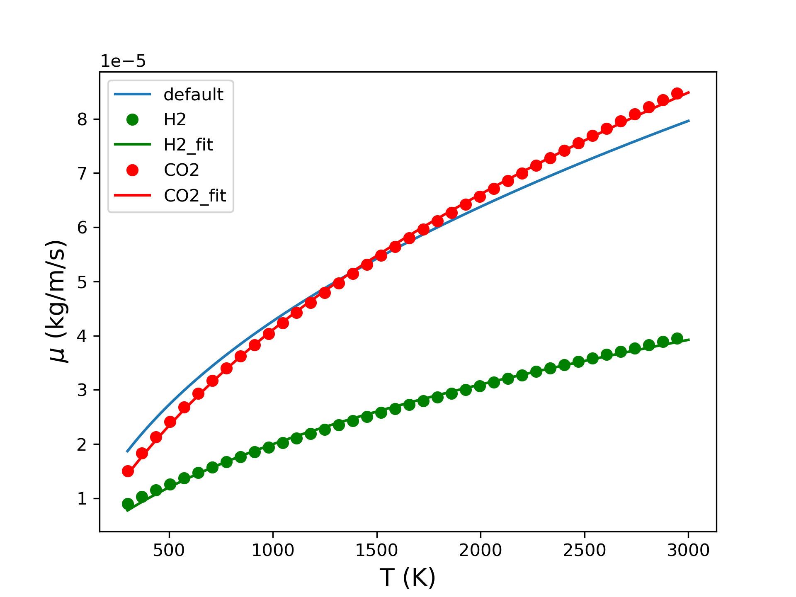

### Convert chemkin transport to OpenFOAM sutherland transport
Then the viscosity is more accurate.

#### steps to follow
- Configure a python environment including cantera, python3, numpy/scipy ...
- Convert the mechanism to cantera format
- run
```bash
python main.py <cantera mechanism> <Target OpenFOAM version, optional, default to be 7>
```

#### Test case to follow
run 
```bash
python main.py chemkin/chem.yaml
```

#### Effects

